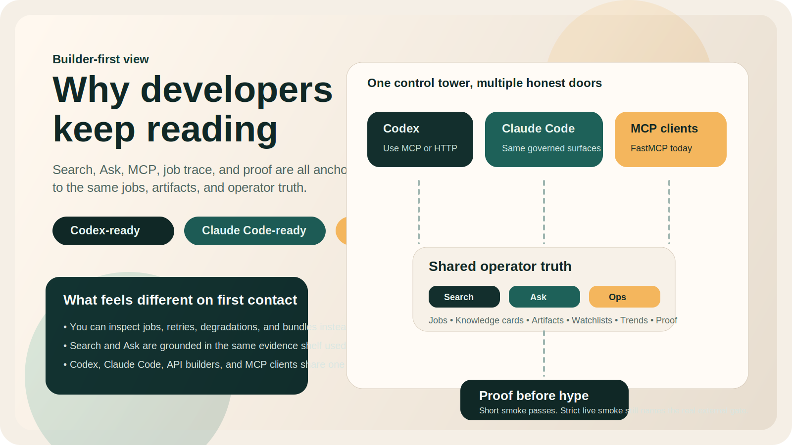

# See It Fast

If the README is the front door, this page is the shop window.

This page is for fast evaluation. It is not a hosted demo, cloud sandbox, or one-click trial.

The goal here is simple:

1. show what SourceHarbor looks like
2. show what comes out of it
3. let you decide whether it is worth a deeper evaluation

If you like what you see here, the next step is [run it locally](./start-here.md), not "open the live app."

<p>
  
</p>

<p>
  
</p>

## The 20-Second Mental Model

SourceHarbor is not just a summarizer.

It is a full intake-to-digest loop:

- sources come in from YouTube, Bilibili, and RSS
- a job-backed pipeline processes each item
- operators read the result in a digest flow
- agents reuse the same evidence through API and MCP

The source story is intentionally uneven on purpose:

- YouTube and Bilibili are the strongest supported intake templates today
- RSSHub and generic RSS are real substrate paths, but they remain more generalized than the strongest video-first flows

## The Three Surfaces That Matter First

### 1. Command Center

This is the operator home base.

What you should picture:

- subscription count
- discovered videos
- queued and failed jobs
- one place to trigger intake and inspect recent activity

Why it matters:

- it turns the repo from "a bunch of scripts" into a usable operating surface

### 2. Digest Feed

This is the reading surface.

Representative current feed shape:

- title: `AI Weekly`
- source label: `YouTube · Tech Channel`
- category label: `Tech`
- body path: digest markdown plus artifact metadata

Why it matters:

- the output is meant to be read, not just stored

### 3. Job Trace

This is the evidence surface.

What you inspect here:

- `job_id`
- status and pipeline final status
- step summary
- retry count
- artifact references

Why it matters:

- when something fails, you can debug with receipts instead of guesswork

## What The Result Looks Like

SourceHarbor's digest artifact template already tells the story of the output shape:

```markdown
# <title>

> Source: [Original video](<source_url>)
> Platform: <platform> | Video ID: <video_uid> | Generated at: <generated_at>

## One-Minute Summary
<tldr>

## What This Covers
<summary>

## Key Takeaways
<highlights>
```

That is the key idea:

- not just transcript text
- not just one summary blob
- a reusable artifact with traceable structure

## The 60-Second Evaluation Path

If you want confidence without booting the full stack yet:

1. Read [README.md](../README.md) for the public story.
2. Read [proof.md](./proof.md) for the evidence ladder.
3. Read [starter-packs/README.md](../starter-packs/README.md) if you want the public CLI / SDK / Codex / Claude Code starter surface.
4. Read [docs/compat/openclaw.md](./compat/openclaw.md) if you specifically care about the new first-cut OpenClaw starter pack and its still-honest boundary.
5. Read [samples/README.md](./samples/README.md) if you want the clearly labeled sample corpus path.
6. Read [architecture.md](./architecture.md) if you want the system map.

If you want a real local run after that, go to [start-here.md](./start-here.md).

## Why This Attracts Builders

If you are evaluating whether this repo is worth starring, forking, or maintaining, this is the shortest honest filter:

| You care about... | SourceHarbor answer |
| --- | --- |
| **Codex / Claude Code fit** | already exposed through MCP + HTTP API, with real Search / Ask / Job Trace surfaces behind it |
| **AI product truth instead of AI vibes** | proof, runtime truth, and project status all explain what is shipped, what is gated, and what is still a bet |
| **A repo that feels like a product, not a pile of scripts** | command center, digest feed, job trace, watchlists, trends, bundles, and sample playground all exist as coherent front doors |
| **A contribution surface that is understandable** | builder docs, compare docs, see-it-fast, and public truth surfaces reduce the amount of archaeology required before contributing |

The honest lure is not "AI magic." It is that SourceHarbor already gives builders:

- a **Codex / Claude Code-friendly** MCP and HTTP API surface
- a **repo-local CLI substrate** through `./bin/sourceharbor help` when they want one discoverable command surface
- a **public packaged CLI and public TypeScript SDK** when they want versionable install/use examples without copying internal code
- a **proof-first** story that names external gates instead of hiding them
- a **compounder layer** worth revisiting when you care about watchlists, trends, and evidence bundles
